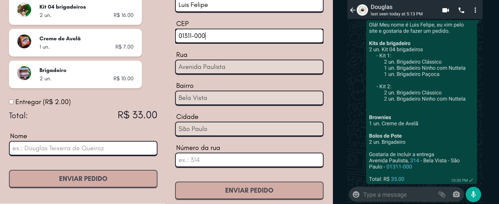

# brigadeiro-maroto

A simple website I've made for my friend to sell brigadeiros (Brazilian desert) online.

---

## Features

### Products selectors

- Checks availability of products
- Support nested selection in case of brigadeiro kits


### Order Finalization

- Displays an overview of selected products
- Get required information about the client
- Validates and fetch location by CEP
- Build and send automatically a WhatsApp message with the order information



---

## Run Locally

Clone the project

```bash
git clone https://github.com/luisfelipesdn12/brigadeiro-maroto-site.git
```

Go to the project directory

```bash
cd new-brigadeiro-maroto
```

Install dependencies

```bash
yarn
# or:
# npm install
```

Build and start the project

```bash
yarn build && yarn start
# npm run start
```

---

## Tech Stack

- Typescript
- Node
- NextJS
- ReactJS
